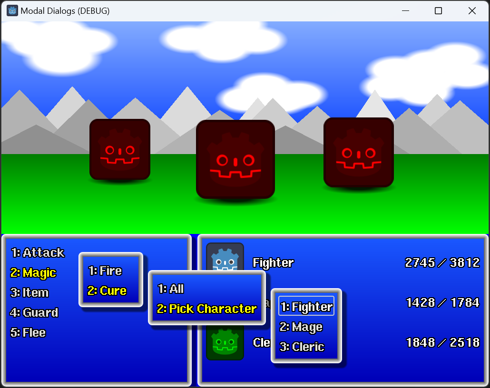

# Godot Modal Dialogs and Menu System

An example of a menu system using modal dialogs in the style of old JRPGs.

**Note:** The whole game-like presentation is just a façade (because I had fun doing it). The whole project is about the menu/dialog system.

Playable web version: https://toxe.itch.io/godot-modal-dialogs

Video: https://www.youtube.com/watch?v=Uu6RuKA8zSU

### Controls

- Use keyboard, mouse or controller.
- Press Enter/Space, 1-9 or Cross/A on controller to select a menu option.
- Press Escape or Circle/B on controller to close a menu.

Select "Flee" to quit the program.

### Credits

- *Cornelia Sans* font by EliDirkx98: https://fontstruct.com/fontstructions/show/1914648
